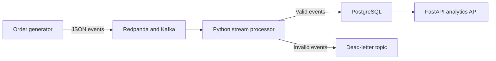
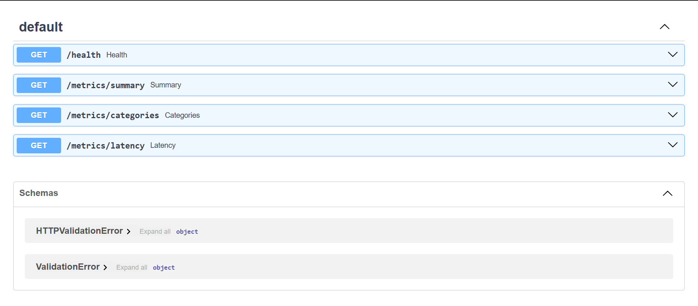
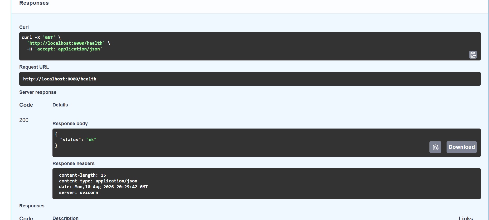
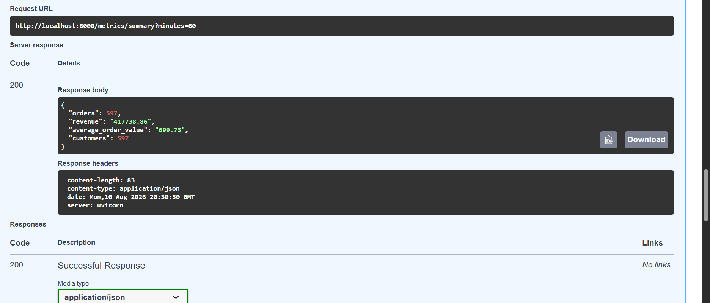
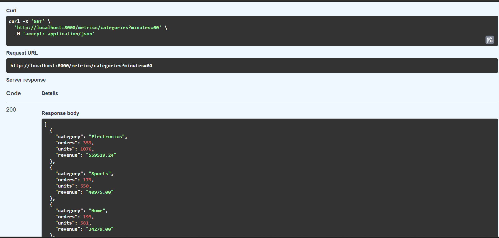
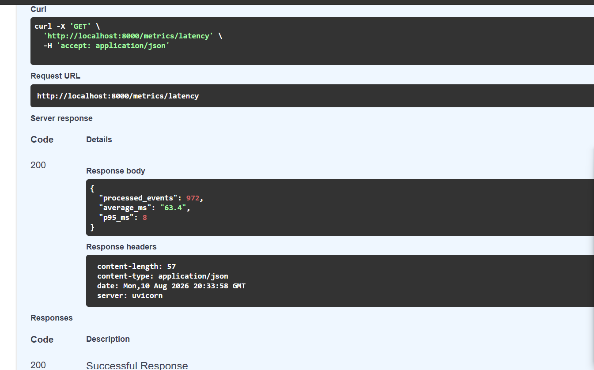

# Real-Time Commerce Data Pipeline

[](https://real-time-commerce-data-pipeline-db39b7gmu7trypz8vlj6sg.streamlit.app/)

A production-style streaming data engineering project that generates e-commerce orders, publishes them to a Kafka-compatible event stream, validates and processes them, stores analytics-ready data in PostgreSQL, and exposes live business metrics through a FastAPI service.

> **Recruiter demo:** the Streamlit dashboard automatically uses a representative
> commerce snapshot when the local FastAPI service is unavailable. Follow the
> [public demo deployment](#-deploy-the-public-recruiter-demo) steps to create a
> shareable `streamlit.app` URL.

## Architecture



## Project in action

| Live API documentation | Successful health check |
| --- | --- |
|  |  |

| Real-time sales summary | Revenue by product category |
| --- | --- |
|  |  |

### Streaming performance



## Engineering features

- Kafka-compatible event ingestion with keyed order events
- Pydantic schema validation and explicit data-quality rules
- Dead-letter queue for malformed events
- At-least-once consumption with manual offset commits
- Idempotent PostgreSQL writes using unique event IDs
- Transactional order and processing-metric persistence
- Analytics-ready SQL view and indexed tables
- Live revenue, category and processing-latency endpoints
- Container health checks and dependency-aware startup
- Unit tests and GitHub Actions CI

## Technology stack

Python 3.12, Redpanda (Kafka API), PostgreSQL 16, FastAPI, Docker Compose, Pydantic, pytest and GitHub Actions.

## Run locally

Prerequisites: Docker Desktop and Git.

```bash
git clone https://github.com/Banoth281/real-time-commerce-data-pipeline.git
cd real-time-commerce-data-pipeline
cp .env.example .env
docker compose up --build -d
```

On Windows PowerShell, use:

```powershell
Copy-Item .env.example .env
docker compose up --build -d
```

Wait about 30 seconds, then open:

- API documentation: http://localhost:8000/docs
- Health check: http://localhost:8000/health
- Last-hour summary: http://localhost:8000/metrics/summary?minutes=60
- Sales by category: http://localhost:8000/metrics/categories?minutes=60
- Pipeline latency: http://localhost:8000/metrics/latency

View the streaming services:

```bash
docker compose logs -f producer processor api
```

Stop the project:

```bash
docker compose down
```

Delete all generated data and restart cleanly:

```bash
docker compose down -v
```

## Example event

```json
{
  "event_id": "1b3f8d52-8492-47e8-a944-7b9f30c4ae89",
  "order_id": "84392240-77ae-4030-8212-c66f73a12824",
  "customer_id": "cc83c928-36cb-4302-b414-caa700496e7b",
  "product_id": "laptop",
  "category": "Electronics",
  "quantity": 2,
  "unit_price": 899.99,
  "country": "GB",
  "event_time": "2026-08-10T22:00:00+00:00"
}
```

## Data reliability design

The processor validates every event before storage. Invalid messages go to `commerce.orders.dlq.v1`. Valid events and their processing metrics are written in one database transaction. The Kafka offset is committed only after the transaction succeeds. If the processor crashes between the database write and offset commit, Kafka may redeliver the event; the primary key on `event_id` makes that replay safe.

## Run tests

```bash
python -m venv .venv
# Windows: .venv\Scripts\activate
# macOS/Linux: source .venv/bin/activate
pip install -r requirements.txt
python -m pytest -q
```

## Suggested portfolio description

> Built a containerised real-time e-commerce analytics pipeline using Python, Kafka-compatible Redpanda, PostgreSQL and FastAPI. Implemented schema validation, dead-letter handling, manual offset management, transactional persistence and idempotent event processing, with live revenue and latency metrics exposed through REST APIs.


## 🌐 Deploy the Public Recruiter Demo

The public dashboard does not require Redpanda/Kafka, PostgreSQL or FastAPI. It
uses the representative snapshot in `dashboard/demo_data.json`. When a
reachable API is configured, headline sales, category and latency metrics
automatically switch to live mode.

1. Sign in to [Streamlit Community Cloud](https://share.streamlit.io/) with GitHub.
2. Select **Create app** and enter:
   - Repository: `Banoth281/real-time-commerce-data-pipeline`
   - Branch: `main`
   - App file: `dashboard/app.py`
   - Python version: `3.12`
3. Choose an available app URL and select **Deploy**.
4. Open the public URL in a private browser window to confirm recruiter access.

Streamlit uses `dashboard/requirements.txt`, keeping the hosted demo small and
independent from the complete streaming environment.

After deployment, add the real URL near the top of this README:

```markdown
[](https://YOUR-APP.streamlit.app)
```

### Optional live API mode

Set `API_BASE_URL` in Streamlit secrets to a publicly hosted FastAPI base URL.
If it is unreachable, the dashboard falls back safely to portfolio demo mode.

## Dashboard structure

```text
dashboard/
├── app.py
├── demo_data.json
└── requirements.txt
```

## Future cloud extension

Deploy the same design using Amazon MSK or Azure Event Hubs, a managed PostgreSQL service, object-storage archival, dbt transformations, Prometheus/Grafana monitoring and Terraform infrastructure.
